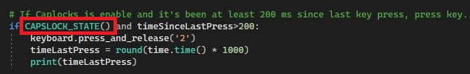

# Python Toggleable Key Presser

Just a simple script to spam a key depending on whever Caps lock, Num lock or Scroll lock is enabled.

## How to use it

By default, the script will press `2` every 200 ms whenever the Caps lock is enable. To alter the script to use the Num lock or Scroll lock keys instead, change `CAPSLOCK_STATE()` to either `NUMLOCK_STATE()` 

To change the frequency of pressing, change 200 value to a desired interval in milliseconds.

To change the key to be pressed, change the literal `2` in the statement below. For a full explanation of support keys and syntax, refer to https://pypi.org/project/keyboard/

